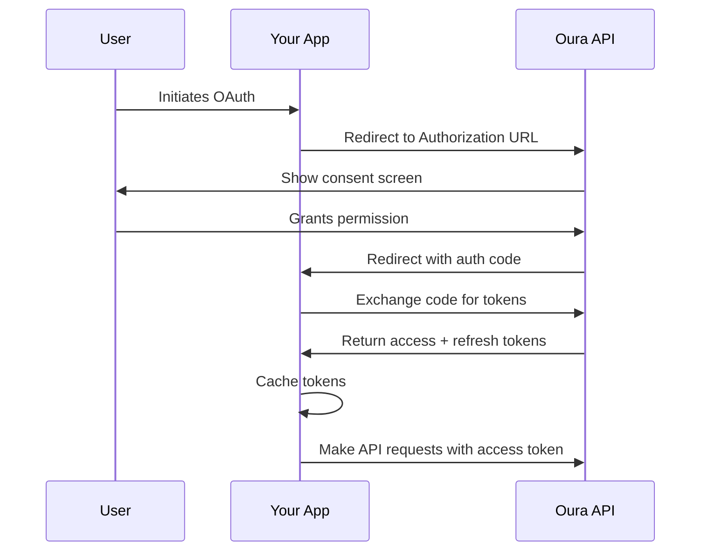

# OAuth Setup Guide for Oura MCP Server

This guide explains how to set up OAuth authentication with the Oura API for multi-user or production applications.

> **Note:** For personal use, we recommend using [Personal Access Tokens](./README.md#personal-access-token-setup) instead. OAuth is more complex but necessary for production applications serving multiple users.

## Table of Contents

- [When to Use OAuth](#when-to-use-oauth)
- [OAuth vs Personal Access Token](#oauth-vs-personal-access-token)
- [Step-by-Step Setup](#step-by-step-setup)
- [OAuth Flow](#oauth-flow)
- [Token Refresh](#token-refresh)
- [Troubleshooting](#troubleshooting)

## When to Use OAuth

Use OAuth when you are:
- Building a multi-user application
- Creating a commercial service
- Need automated token refresh
- Require strict security compliance
- Deploying to production environments

Use Personal Access Tokens for:
- Personal use (recommended)
- Development and testing
- Single-user applications
- Quick prototyping

## OAuth vs Personal Access Token

| Feature | Personal Access Token | OAuth |
|---------|----------------------|-------|
| **Setup Complexity** | ✅ Simple (1 step) | ⚠️ Complex (multiple steps) |
| **Use Case** | Personal use | Multi-user apps |
| **Token Expiration** | Never expires | Expires (refresh needed) |
| **Scope Control** | Read-only | Configurable |
| **Security** | ✅ Good for personal use | ✅ Best for production |
| **Multi-user** | ❌ One token per user | ✅ Automatic per-user auth |
| **Setup Time** | 2 minutes | 15-30 minutes |

## Step-by-Step Setup

### Step 1: Create an OAuth Application

1. Navigate to [Oura Cloud Developer Portal](https://cloud.ouraring.com/oauth/applications)
2. Log in with your Oura account
3. Click **"Create New Application"**

### Step 2: Configure Your Application

Fill in the application details:

- **Application Name**: `Thanos MCP Server` (or your app name)
- **Description**: Brief description of your application
- **Redirect URI**: The URL where users will be redirected after authorization
  - For local development: `http://localhost:3000/oauth/callback`
  - For production: `https://your-domain.com/oauth/callback`
- **Scopes**: Select the permissions you need
  - ✅ `daily` - Daily summaries (sleep, readiness, activity)
  - ✅ `heartrate` - Heart rate data
  - ✅ `workout` - Workout data (optional)
  - ✅ `tag` - Tags and notes (optional)
  - ✅ `personal` - Personal information (optional)

### Step 3: Save Your Credentials

After creating the application, you'll receive:
- **Client ID**: A public identifier for your application
- **Client Secret**: A secret key (keep this secure!)

**Copy both values immediately** - the Client Secret may only be shown once.

### Step 4: Configure Environment Variables

Update your `.env` file:

```bash
# OAuth Credentials
OURA_CLIENT_ID=your_client_id_here
OURA_CLIENT_SECRET=your_client_secret_here

# Optional: Pre-configured access token (from OAuth flow)
# OURA_ACCESS_TOKEN=your_access_token_here

# Optional: Pre-configured refresh token
# OURA_REFRESH_TOKEN=your_refresh_token_here
```

**Important:** Comment out or remove `OURA_ACCESS_TOKEN` if you're using full OAuth flow. The server will obtain tokens through the OAuth process.

### Step 5: Implement OAuth Flow (For Web Applications)

If you're building a web application, you'll need to implement the OAuth authorization code flow:

#### 5.1: Generate Authorization URL

```typescript
import { getOAuthClient } from './src/api/oauth.js';

const oauthClient = getOAuthClient();
const authUrl = oauthClient.getAuthorizationUrl('http://localhost:3000/oauth/callback');

// Redirect user to authUrl
console.log('Visit this URL to authorize:', authUrl);
```

#### 5.2: Handle Callback

After the user authorizes your application, Oura will redirect them to your redirect URI with an authorization code:

```
http://localhost:3000/oauth/callback?code=AUTHORIZATION_CODE
```

#### 5.3: Exchange Code for Tokens

```typescript
import { getOAuthClient } from './src/api/oauth.js';

const oauthClient = getOAuthClient();
const code = 'AUTHORIZATION_CODE_FROM_CALLBACK';

const tokens = await oauthClient.exchangeCodeForToken(code, 'http://localhost:3000/oauth/callback');

console.log('Access Token:', tokens.access_token);
console.log('Refresh Token:', tokens.refresh_token);

// Tokens are automatically cached in .cache/oura-tokens.json
```

## OAuth Flow



## Token Refresh

Access tokens expire after a certain period. The server automatically refreshes tokens when needed:

```typescript
import { getOAuthClient } from './src/api/oauth.js';

const oauthClient = getOAuthClient();

// This method automatically refreshes the token if expired
const accessToken = await oauthClient.getValidAccessToken();

// Manual refresh
const newTokens = await oauthClient.refreshAccessToken();
```

### How Automatic Refresh Works

1. **Before each API request**, the client checks if the token is expired
2. **If expiring within 5 minutes**, it automatically refreshes
3. **New tokens are cached** to `.cache/oura-tokens.json`
4. **Subsequent requests** use the new token

### Token Expiration

- **Access Token**: Typically valid for 1 hour
- **Refresh Token**: Typically valid for 60 days
- **Auto-refresh Buffer**: Tokens refresh 5 minutes before expiration

## For Single-User / Personal Use with OAuth

If you want to use OAuth but don't need the full web flow:

1. Complete the OAuth flow once manually
2. Copy the tokens from `.cache/oura-tokens.json`
3. Set them as environment variables:

```bash
OURA_ACCESS_TOKEN=your_access_token_from_oauth
OURA_REFRESH_TOKEN=your_refresh_token_from_oauth
```

The server will automatically refresh these tokens as needed.

## Troubleshooting

### "OAuth configuration missing" error

**Problem**: Server can't find OAuth credentials

**Solution**:
```bash
# Verify these are set in .env:
OURA_CLIENT_ID=your_client_id_here
OURA_CLIENT_SECRET=your_client_secret_here

# Make sure you've copied .env.example to .env
cp .env.example .env
```

### "Invalid client credentials" error

**Problem**: Client ID or Secret is incorrect

**Solutions**:
1. Verify credentials at https://cloud.ouraring.com/oauth/applications
2. Check for extra spaces or quotes in `.env` file
3. Regenerate Client Secret if compromised
4. Ensure you copied the entire secret (they can be long!)

### "Invalid redirect URI" error

**Problem**: Redirect URI doesn't match what's registered

**Solutions**:
1. Check the redirect URI in your OAuth application settings
2. Must match **exactly** (including trailing slashes, http vs https)
3. Common mistake: `http://localhost:3000/callback` vs `http://localhost:3000/oauth/callback`

### "Token expired" with no refresh

**Problem**: Refresh token is expired or invalid

**Solutions**:
1. Re-run the OAuth flow to get new tokens
2. Check if refresh token is in `.cache/oura-tokens.json`
3. Verify refresh token wasn't revoked at https://cloud.ouraring.com/
4. For testing, switch to Personal Access Token (doesn't expire)

### Redirect URI for Claude Desktop

**Problem**: Claude Desktop runs locally, how to set redirect URI?

**Solution**: Claude Desktop doesn't support web OAuth flow. Use one of these approaches:

**Option 1 (Recommended)**: Use Personal Access Token
```bash
OURA_ACCESS_TOKEN=your_personal_access_token
```

**Option 2**: Run OAuth flow separately, copy tokens:
1. Run OAuth flow in a web browser or separate script
2. Get tokens from `.cache/oura-tokens.json`
3. Set as environment variables in Claude Desktop config:
```json
{
  "mcpServers": {
    "oura-mcp": {
      "command": "node",
      "args": ["/path/to/oura-mcp/dist/index.js"],
      "env": {
        "OURA_ACCESS_TOKEN": "token_from_oauth_flow",
        "OURA_REFRESH_TOKEN": "refresh_from_oauth_flow"
      }
    }
  }
}
```

## Security Best Practices

### ✅ DO:
- Store credentials in `.env` file (never commit to git)
- Use HTTPS for production redirect URIs
- Rotate Client Secrets periodically
- Implement proper error handling for token expiration
- Use refresh tokens to minimize re-authorization

### ❌ DON'T:
- Never commit `.env` file to version control
- Never expose Client Secret in client-side code
- Don't use OAuth for simple personal projects (use PAT instead)
- Don't share tokens between users
- Don't hardcode credentials in source code

## Next Steps

- Return to [README.md](./README.md) for server setup
- See [EXAMPLES.md](./EXAMPLES.md) for usage examples
- Check [troubleshooting guide](./README.md#troubleshooting) for common issues

## Resources

- [Oura API Documentation](https://cloud.ouraring.com/docs/)
- [OAuth 2.0 Specification](https://oauth.net/2/)
- [Oura Developer Portal](https://cloud.ouraring.com/oauth/applications)
